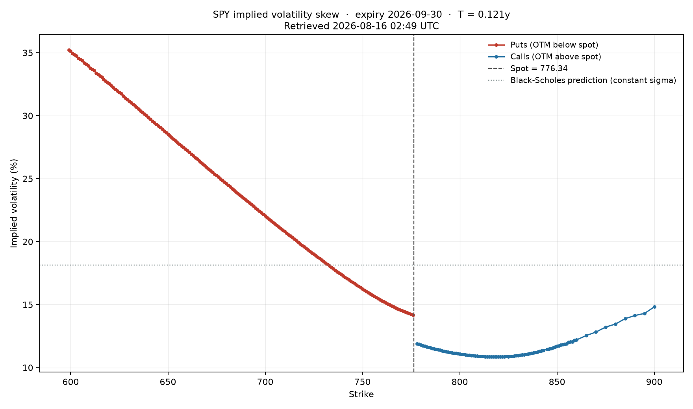

[](https://github.com/gloryebusiness-eng/Options-Pricing-Engine/actions/workflows/tests.yml)

# Options Pricing Engine

European option pricing under Black-Scholes-Merton, with analytical Greeks,
implied volatility calibration, and empirical validation against live market
data.

The engine is used here to measure where its own model fails.



## The result

Black-Scholes assumes a single constant volatility for the underlying. If that
held, solving for implied volatility across every strike of one expiry would
return the same number each time and the curve above would be flat.

Measured on the SPY 2026-09-30 expiry (T = 0.121y, spot 776.34), across 268
strikes:

| Region | Implied volatility |
|---|---|
| Downside wing (strikes ~23% below spot) | 30.3% |
| At the money | 14.2% |
| Upside wing (strikes ~14% above spot) | 14.3% |

The downside wing prices at **2.13x** the at-the-money volatility. Real returns
have fatter tails and stronger negative skew than the log-normal distribution
the model assumes, so downside protection is worth more than Black-Scholes
says. Volatility is the only free parameter traders have to express that, so
they mark it up on low strikes.

This skew is not a mathematical necessity. It was largely absent from equity
index options before October 1987 and has persisted since — a fingerprint of a
specific historical repricing of tail risk, not a property of options.

## What is implemented

**Pricing** — Black-Scholes-Merton closed form for European calls and puts,
vectorised over NumPy arrays.

**Greeks** — delta, gamma, vega, theta, rho in closed form. Each is verified
against a central-difference approximation of the same partial derivative
computed from the pricer itself.

**Implied volatility** — Newton-Raphson using analytical vega as the
derivative, with a bracketed Brent fallback where vega collapses. Results carry
conditioning diagnostics.

**Market data** — option chain retrieval with a documented cleaning pipeline;
every filter records its discard count.

## Correctness

Validation is by no-arbitrage property rather than by reference table. An
arbitrage relation must hold for every input regardless of which model produced
the price, so a violation is unambiguous evidence of an implementation error.

Property-based tests (hypothesis) generate several hundred adversarial inputs
per property across spot from \$10 to \$500, volatility from 5% to 200%, and
negative rates.

- **Put-call parity**: `C - P = S - Ke^(-rT)`, to 1e-9. Links the call and put
  formulas through a constraint neither encodes internally.
- **Arbitrage bounds**: `max(S - Ke^(-rT), 0) <= C <= S` and the put analogue.
- **Delta parity**: `Δ_call - Δ_put = 1`, the derivative of put-call parity.
- **Greeks against finite differences**: agreement between a hand-derived
  expression and a numerical derivative of an independent implementation is
  strong evidence both are correct; a calculus error would have to reproduce
  identically along two unrelated computational paths.
- **Round-trip inversion**: price at a known sigma, recover it, within a
  conditioning-aware error budget.

```
46 passed
```

## Conditioning

The sensitivity of recovered volatility to price error is `1/vega`, so vega is
the condition number of the inversion. For deep wings vega falls to the order
of 1e-57: every volatility between 1% and 300% reproduces the observed price to
the last representable bit, and no implied volatility exists to recover.

The solver returns the root but flags it as not identifiable, because a wrong
number is indistinguishable from a right one to any downstream consumer. Surface
construction filters on that flag.

This was discovered when a round-trip test failed in the wings. The test was
asserting a property the problem does not have. The fix was to correct the
test's premise and add the missing diagnostic — not to loosen the tolerance.

## Data quality

Implied volatility is only as good as the quotes behind it. Filters applied,
each logging its discard count:

- zero or missing bid/ask
- crossed or locked markets
- relative spread above 50% of mid
- open interest below 10
- vertical spread arbitrage: a call price must satisfy `-1 <= dC/dK <= 0`
  across adjacent strikes

That last filter was added after observing live SPY quotes where the price fell
\$38.80 across a \$7 strike increment — a violation by a factor of five. Deep
in-the-money contracts do not trade, so their quotes are algorithmic
placeholders that go stale. Per-quote filters cannot detect this; only the
relationship between neighbouring strikes reveals it.

The smile is built from out-of-the-money contracts on both wings — puts below
spot, calls above — so every retained premium is entirely time value. In-the-
money options hold most of their price as intrinsic value, leaving the
volatility-bearing component as a small residual that quote error swamps.

## Known limitations

**Dividends are not modelled.** The pricer assumes a non-dividend-paying
underlying. SPY yields roughly 1.1%, which depresses calls and lifts puts. The
effect is directly visible in the plot as a discontinuity at the put/call seam:
the 776 put implies 14.18% and the 778 call implies 11.90%. Put-call parity
requires these to agree, so the 2.3-point gap is a measurement of the omitted
term. Merton's `q` extension is the correction.

**Flat risk-free rate.** A single rate is used rather than a term structure
interpolated from Treasury yields.

**American exercise is not supported.** Early exercise requires a lattice or
PDE method; a binomial kernel is the natural next addition.

**Calendar-day tenor.** Trading-day conventions differ, and the distinction
matters at short tenors.

## Design

Dependencies point downward only. Pricing kernels are pure functions — they
accept and return numbers, perform no I/O, and never import the data layer.
This keeps them vectorised, fast to test, and interchangeable behind a common
interface: adding a binomial or Monte Carlo kernel requires no change above.

```
src/ope/
├── models/     pricing kernels and Greeks (pure)
├── vol/        implied volatility, surface construction, plots
└── data/       market chain retrieval and cleaning (the only I/O)
```

Every non-obvious choice is recorded in [docs/DECISIONS.md](docs/DECISIONS.md)
with the alternatives considered.

## Usage

```bash
git clone https://github.com/gloryebusiness-eng/Options-Pricing-Engine.git
cd Options-Pricing-Engine
python -m venv .venv && source .venv/bin/activate
pip install -r requirements.txt && pip install -e .
pytest
```

```python
from ope.models.black_scholes import bs_price
from ope.models.greeks import all_greeks
from ope.vol.implied import implied_vol

bs_price(S=100, K=100, T=1.0, r=0.05, sigma=0.20, option_type="call")
# 10.4506

all_greeks(S=100, K=100, T=1.0, r=0.05, sigma=0.20)
# {'delta': 0.6368, 'gamma': 0.0188, 'vega': 37.52, ...}

implied_vol(price=10.4506, S=100, K=100, T=1.0, r=0.05, return_diagnostics=True)
# ImpliedVolResult(volatility=0.2000, method='newton', identifiable=True, ...)
```

Reproduce the figure:

```python
from ope.data.chains import fetch_otm_chain
from ope.vol.surface import build_smile
from ope.vol.plots import plot_smile

snapshot = fetch_otm_chain("SPY")
plot_smile(build_smile(snapshot), snapshot)
```